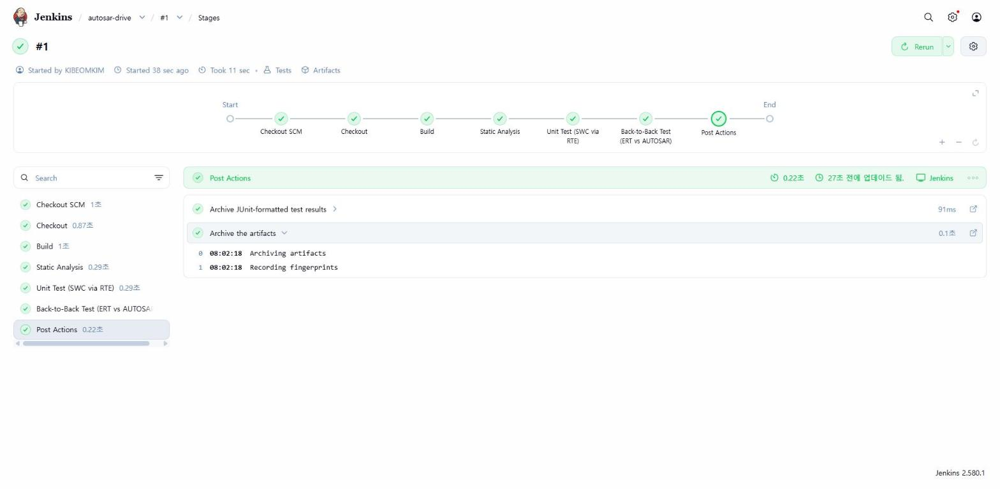
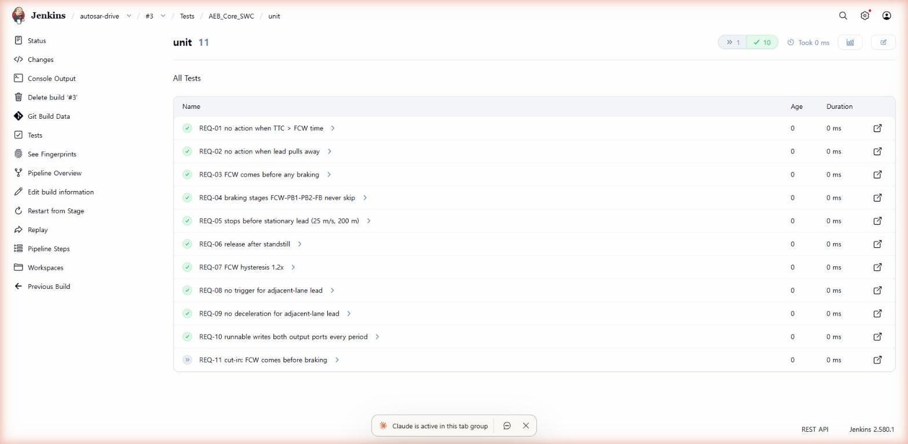

# autosar-drive

Simulink AEB(자동 긴급 제동) 모델을 AUTOSAR Classic SWC로 코드 생성하고 Jenkins로 빌드·테스트를 자동화한 개인 실습 저장소입니다.

## 흐름

1. **MIL**: K-MOOC 자율주행 제어 실습의 AEB 모델(Stateflow FCW → PB1 → PB2 → FB)을 고정 스텝 0.01 s로 바꿔 시뮬레이션
2. **SIL**: Embedded Coder(ert.tlc)로 컨트롤러 C 코드를 만들고 SIL 블록으로 바꿔 모델 결과와 비교 (출력 최대 오차 0)
3. **재설계**: 컨트롤러 안에서 하던 위치 차 계산을 밖(레이더 측)으로 빼고 입력을 상대거리·상대속도·횡방향 오프셋·자차속도 4개로 정리
4. **AUTOSAR 코드 생성**: autosar.tlc로 SWC `AEB_Core_SWC` 생성 (Init / Step 러너블, Rte_IRead / Rte_IWrite, ARXML 4종)
5. **CI**: 이 저장소를 Jenkins가 받아 빌드 → 정적 분석 → 단위 테스트 → Back-to-Back 테스트

작업 관리는 Jira(AEB 프로젝트)에서 단계별 티켓과 버그 티켓으로 했습니다.

## 폴더

```
model_gen/ert/              원본 AEB Controller의 ERT 생성 코드 (SIL 비교 기준)
model_gen/autosar/src/      AEB_Core_SWC 생성 코드
model_gen/autosar/arxml/    component / datatype / implementation / interface ARXML
model_gen/autosar/rte_stub/ Simulink가 만든 RTE 헤더 스텁
platform/                   호스트 빌드용 최소 Platform_Types / Std_Types / Compiler 헤더
test/rte_test_double.c      RTE 역할을 대신하는 테스트 더블 (IRead 값 주입, IWrite 값 기록)
test/test_swc_unit.c        요구사항 기반 단위 테스트 11개
test/test_b2b.c             ERT 코드 vs AUTOSAR 코드 Back-to-Back 테스트 6개
docs/requirements.md        요구사항 ↔ 테스트 추적표, AEB-12·13 기록
docs/ert_vs_autosar.md      일반 C 코드와 AUTOSAR 코드 비교
docs/autosar_concepts.md    Classic AUTOSAR 개념 정리 (이 저장소 예시 기준)
jenkins/                    gcc·cppcheck가 들어간 Jenkins 이미지
Jenkinsfile                 파이프라인 정의
```

## 로컬 실행

```
make all     # SWC 라이브러리와 테스트 바이너리 빌드 (-Wall -Wextra -pedantic -Werror)
make test    # 단위 테스트 + Back-to-Back 테스트, reports/junit-*.xml 생성
make static  # cppcheck
```

## Jenkins 실행 (Docker Desktop)

```
docker build -t aeb-jenkins jenkins
docker run -d --name aeb-jenkins -p 127.0.0.1:8080:8080 -v aeb_jenkins_home:/var/jenkins_home aeb-jenkins
```

http://localhost:8080 에서 Pipeline 잡을 만들고 "Pipeline script from SCM"으로 이 저장소를 지정합니다.

## 결과

- 빌드: 경고 0 (-Werror)
- cppcheck(warning, style, performance, portability): 지적 0
- 단위 테스트: 11개 모두 PASS
- Back-to-Back: 5개 시나리오 최대 오차 0 + 인접 차로 시나리오는 AEB-12 의도 차이 확인
- 테스트로 찾은 AEB-12(인접 차로 선행차에 감속 명령)는 모델 수정 → 코드 재생성 → CI 재검증으로 닫았습니다
- AEB-13(끼어들기 시 FCW 없이 제동)은 TTC 계산으로 검토한 결과 요구사항 쪽을 고쳐 닫았습니다 (docs/requirements.md)

| 파이프라인 단계 | 테스트 결과 |
|---|---|
|  |  |

## 범위와 한계

- 원본 AEB 모델은 강의 실습 모델이고 입력 포트 재설계와 SWC 구성, 테스트 코드는 직접 작성했습니다.
- RTE는 실제 BSW가 아니라 테스트 더블입니다. PIL·HIL은 장비가 없어 하지 않았습니다.
- platform 헤더는 호스트 빌드용 최소 정의입니다. 실제 ECU에서는 BSW 공급사 헤더로 바꿔야 합니다.
